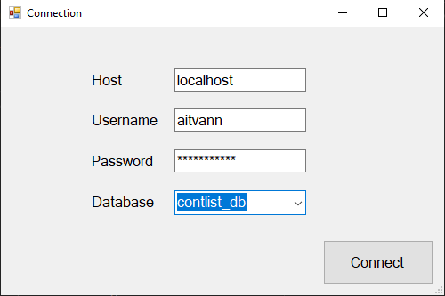
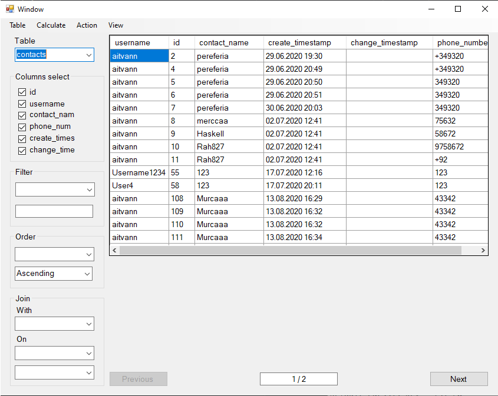

# VisualDB

Simple GUI application for visual work with PostgresSQL database.

## Features

List of already implemented features:

* View table with
  * Column selection
  * Filtering
  * Ordering
  * Joining another table
  * Aggregation
* Insertion into table
* Creation new table
* Creation view

## Usage

Connection form

Table view

## Issues

Bugs & Issues should be reported at GitHub.
